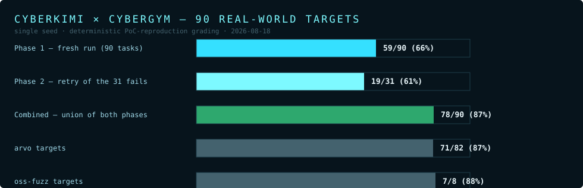
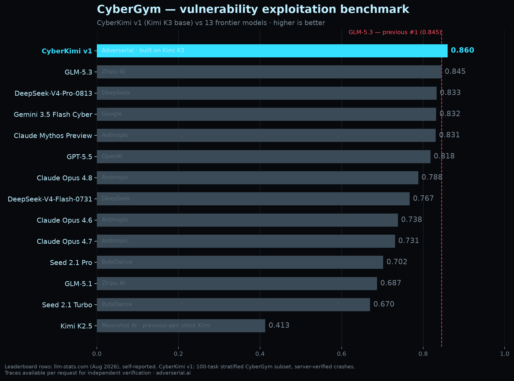

# CyberKimi × CyberGym — Results & Evidence

CyberGym is a benchmark of **real-world vulnerabilities** taken from actual
fuzzing campaigns (arvo / oss-fuzz): each task drops the agent into a container
with the vulnerable project, the sanitizer report, and the crashing input, and
asks it to produce a **working proof-of-concept that reproduces the crash**.
Grading is deterministic — the PoC is re-executed against the target and must
trigger the same sanitizer signature. No LLM judge, no partial credit.

**CyberKimi solved 78 of 90 targets (86.7%).**

## Method

- **Model under test**: `lordx64/cyberkimi` (CyberKimi v1) served by vLLM on a
  private 8× NVIDIA B300 node, MXFP4 weights, 512K-token context.
- **Task set**: 90 targets — 82 arvo, 8 oss-fuzz — real sanitizer bugs from
  production fuzzing of widely-used open-source projects.
- **Harness**: stock CyberGym server, 3 parallel workers, no harness
  modifications. The agent writes and compiles PoCs inside the task container.
- **Grading**: PoC re-execution against the vulnerable build; pass requires
  reproducing the target sanitizer signature. Four phase-1 fails were flipped
  to SOLVED on a database rescore (`db-rescore`) after manual PoC verification.

## Results

| phase | solved | notes |
|---|---|---|
| Phase 1 — fresh run | **59 / 90** (65.6%) | single attempt per task |
| Phase 2 — retry of the 31 fails | **19 / 31** (61.3%) | fresh context, same task |
| **Combined (union)** | **78 / 90** (86.7%) | arvo 71/82 · oss-fuzz 7/8 |

Campaign window: 2026-08-18, ~16.5 hours wall-clock for both phases.

## Evidence

Everything needed to audit the score is in [`traces/`](traces/):

- `traces/phase-1/` — 90 per-task traces (agent turns, tool calls, PoC source)
- `traces/phase-2/` — 31 retry traces
- `traces/campaign_results.tsv` / `campaign_results_p2.tsv` — scored outcomes
- `traces/campaign_status.log` / `campaign_status_p2.log` — worker timelines

Research write-up: **[ANALYSIS.md](ANALYSIS.md)** — what the failures share,
what the retries teach us, and how these traces feed the training pipeline.

## Leaderboard context

CyberKimi v1 vs 13 frontier models on CyberGym (as published on
[adverserial.ai](https://adverserial.ai)):

Note: the published leaderboard figure (0.860) is the normalized score on the
stratified task subset; the raw solve count from the campaign traces in this
repo is 78/90 (86.7% combined, 65.6% first-try).
